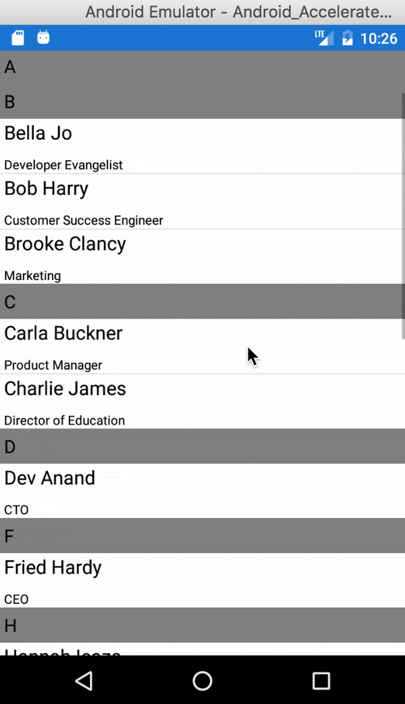
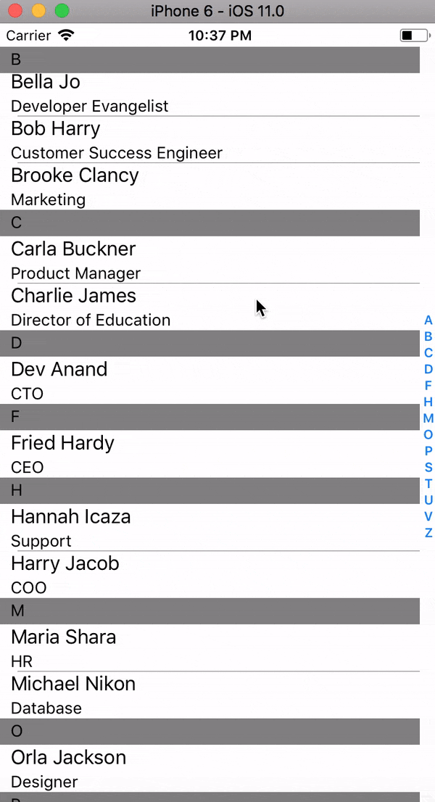

# Xamarin.Forms-StickyHeaderListView
A ListView Control to display the employee directory with their names and department grouped according to their names alphabetically. For this iOS by default provides sticky list header view inside the list view where as in android I have done custom rendering to display the sticky list view using “emilsjolander” library.

**Reference :** https://github.com/emilsjolander/StickyListHeaders

## Android

## iOS

